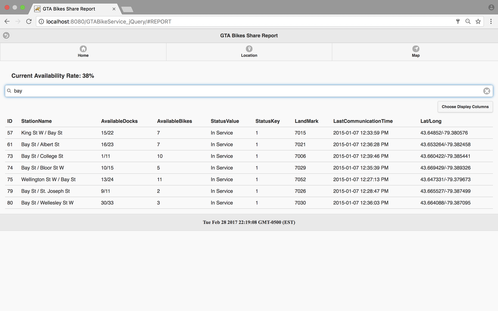

# GTABikeService_jQuery
> This is a simple web app built on top of jQuery js library. All the data used are retrieved 
from json file. 

## Demo

1. `Home Page`: including the system introduction and bikes current available in the system
    

2. `Report Page`: format and display the data retrieved from json file
    

3. `Search on Report Page`: search for specific information through key works
    

4. `Config layout for Report Page`: user can customize the items show on the columns
    

5. `Details Page`: this page shows up when click item on report page
    

6. `Map for bike stations`
    

7. `Map Icon`: click to show the bike number available in specific location
    

8. `Get Current Location`: user can locate current location and it will shows five nearest bike stations for user
    

